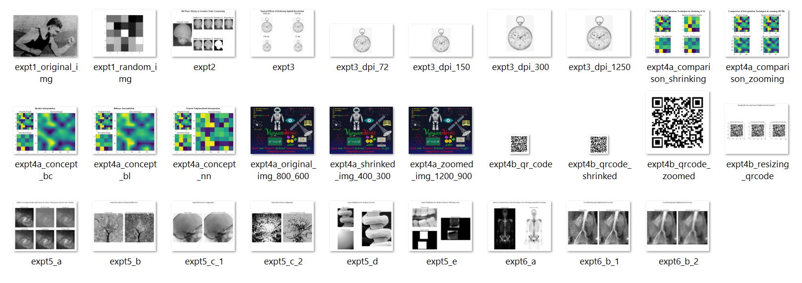

# **Digital Image Processing** 

## Acknowledgements

---

**_Special Thanks to:_**

- **_God_**, all the things I will and have learnt initiate and terminate from whom, who supports me in all my endeavours.
- **_Prof. Purti Savardekar, Goa Engineering College_**, my teacher in the course of Digital Image Processing. Most of the programs written are either a part of the practicals or implementations of things learnt in theory and practical.
- **_All my peers_**, in the course of Digital Image Processing for their active support.

## Disclaimer

---

The intention to create the repository is for learning purposes and to share the things that may help DIP enthusiast in their journey. Updation of the repository to my best possible efforts will be a priority. All programs have been written in python and most of the them have been implemented from scratch to learn the nitti grittis using basic libraries like numpy and matplotlib. The programs which couldn't been dived deep have been implemented using existing functions from available image processing libraries like openCV, skimage etc. Please feel free to share and comment, as it will help to improve it even further. Incase of queries or doubts please contact: **mailtovigyannveshi@gmail.com**

The experiments have been written as separate python files. Images used in the experiments are taken from reference: https://www.imageprocessingplace.com/DIP-3E/dip3e_book_images_downloads.htm and are used only for study purposes.
They are arranged  chapterwise in their respective folders.  All extra images used have been stored in the folder: **extra_images**, the input given and output generated are stored in folder: **input_output**, for easy and repetitive access, some of the functions have been combined into a class **DipTools**, in file **dip_toolbox.py**. 

## Experiments Done:
---
| Experiment No. | Title                                                                                       |
|----------------|---------------------------------------------------------------------------------------------|
| 1.             | Introduction to Digital Image Processing                                                    |
| 2.             | Bit Plane Slicing                                                                           |
| 3.             | Image Resolution                                                                            |
| 4.             | Image Interpolation :                                                                       |
|                | a) Nearest Neighbourhood, Bilinear, Bicubic interpolations and their comparison             |
|                | b) Resizing QR codes using Nearest Neighbourhood interpolation                              |
| 5.             | Arithmetic Operations in Digital Image Processing                                           |
|                | a) Addition (Averaging) of noisy images for noise reduction                                 |
|                | b) Image Subtraction for Enhancing Differences                                              |
|                | c) Image Subtraction for Angiography                                                        |
|                | d) Image Multiplication for Shading Correction                                              |
|                | e) Image Multiplication for 'Region of Interest' (ROI) operations                           |
| 6.             | Point and Neighbourhood Operations in Digital Image Processing                              |
|                | a) Intensity Transformation to obtain the negative of an 8-bit image using Point Processing |
|                |  b) Local Blurring using Neighbourhood Processing

